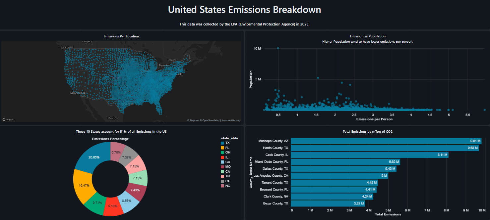

# databricks-sql-emissions-dashboard

Simple dashboard built with Databricks SQL to explore CO₂ emissions data.

This project demonstrates the use of Databricks SQL (Spark SQL) to build a simple analytical dashboard using CO₂ emissions data.

## Tools
- Databricks SQL
- Apache Spark (Spark SQL)
- GitHub

## Objective
Showcase basic SQL queries, visualizations, and dashboard construction for learning purposes.

## Project Structure
- `/sql`: SQL queries used to build the dashboard
- `/images`: Dashboard screenshots
- `/docs`: Project documentation

## Dashboard Preview

